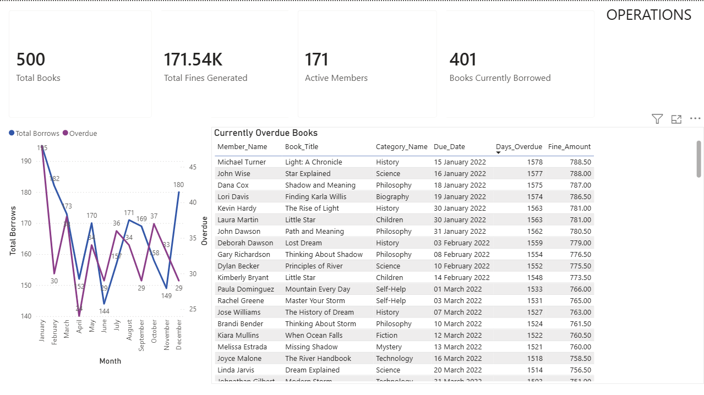
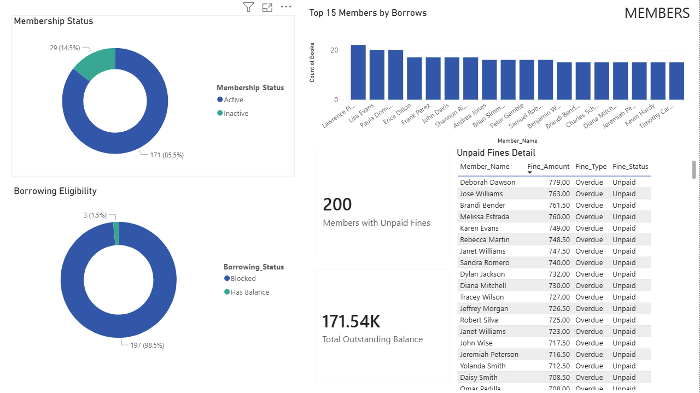
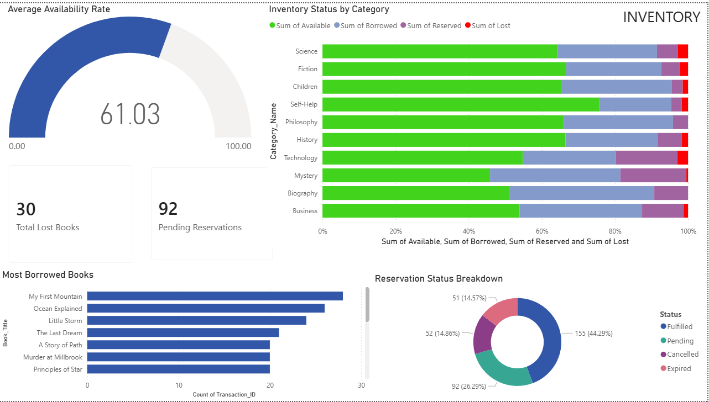

# Belly Library Management System
### End-to-End Database Design, SQL Analytics & Power BI Dashboard


---

## Overview

A full-stack database project for **Belly Library** — a community public library — built to replace manual record-keeping with an automated, data-driven Library Management System (LMS).

The project covers the complete data lifecycle: relational schema design → synthetic data generation → advanced SQL analytics → Power BI dashboard for operational reporting.

**Originally designed as a group academic project (BANA 570 — Data Management, Oregon State University). Rebuilt and upgraded to industry standards independently.**

---

## Dashboard Preview

### Operations Overview


### Member Analytics


### Inventory & Reservations


> 📊 **[View Live Dashboard →](YOUR_POWER_BI_SERVICE_URL_HERE)**

---

## Business Problem

Belly Library faced three core operational challenges:

| Problem | Impact |
|---|---|
| Manual book tracking | Misplaced books, slow checkout |
| No overdue automation | Unreturned books, lost revenue |
| Limited member visibility | No borrowing history or fine tracking |

---

## Solution Architecture

```
Raw Data Sources
      │
      ▼
┌─────────────────┐     ┌─────────────────┐
│   schema.sql    │────▶│   library.db    │  SQLite Database
│  (DDL + Index)  │     │  (8 tables)     │
└─────────────────┘     └────────┬────────┘
                                 │
                    ┌────────────▼────────────┐
                    │    seed_data.py          │
                    │  500 books · 200 members │
                    │  2,000 transactions      │
                    └────────────┬────────────┘
                                 │
                    ┌────────────▼────────────┐
                    │  sql/queries/ (10 files) │
                    │  CTEs · Window Functions │
                    │  Ranking · Aggregations  │
                    └────────────┬────────────┘
                                 │
                    ┌────────────▼────────────┐
                    │  export_for_powerbi.py   │
                    │  7 clean CSV exports     │
                    └────────────┬────────────┘
                                 │
                    ┌────────────▼────────────┐
                    │   Power BI Dashboard     │
                    │  3 pages · 18 visuals    │
                    └─────────────────────────┘
```

---

## Database Schema

**8 relational tables** with enforced referential integrity:

| Table | Description | Key Fields |
|---|---|---|
| `Books` | Central inventory | Book_ID (PK), Category_ID (FK), Availability |
| `Members` | Library users | Member_ID (PK), Membership_Status, Outstanding_Fines |
| `Transactions` | Borrow/return events | Transaction_ID (PK), Member_ID (FK), Book_ID (FK), Fine_Amount |
| `Fines` | Penalty ledger | Fine_ID (PK), Transaction_ID (FK), Fine_Status, Fine_Type |
| `Reservations` | Waitlist queue | Reservation_ID (PK), Status, Queue_Position |
| `Categories` | Book genres | Category_ID (PK), Category_Name |
| `Publishers` | Book suppliers | Publisher_ID (PK), Publisher_Name |
| `Librarians` | Staff accounts | Librarian_ID (PK), Role (Admin/Staff) |

**Business rules enforced via constraints:**
- Members can borrow max 5 books at a time
- Members with Outstanding_Fines > $10 are blocked from borrowing
- Overdue fine rate: $0.50 per day
- Reservations expire after 7 days if uncollected

---

## SQL Query Library

10 analytical queries in `sql/queries/` — each targeting a real business question:

| File | Business Question | Key Technique |
|---|---|---|
| `01_overdue_books_active.sql` | Which books are currently overdue? | Multi-table JOIN, `julianday()` |
| `02_most_borrowed_books.sql` | Which books are in highest demand? | CTE + `RANK()` + `PARTITION BY` |
| `03_member_leaderboard.sql` | Who are the most active members? | Dual `RANK()` on multiple dimensions |
| `04_monthly_borrow_trends.sql` | Is borrowing growing over time? | `LAG()`, rolling avg with `ROWS BETWEEN` |
| `05_fine_collection_analysis.sql` | How much is owed vs collected? | CTE + `CROSS JOIN` for % of total |
| `06_delinquent_members.sql` | Who should be suspended? | `HAVING`, `RANK()`, `CASE WHEN` flags |
| `07_category_inventory_health.sql` | Which genres have low availability? | Conditional aggregation |
| `08_member_lifetime_stats.sql` | Full borrowing + fine history per member | Multiple CTEs + `COALESCE` |
| `09_librarian_activity.sql` | Which staff process the most transactions? | `COUNT DISTINCT`, performance `RANK()` |
| `10_reservation_fulfillment.sql` | Which genres have the worst waitlist? | Multi-rate % + fulfillment `RANK()` |

---

## Power BI Dashboard

**3 report pages, 18 visuals** connected to SQLite via CSV export layer:

**Page 1 — Operations Overview**
- KPI cards: Total Books, Books Borrowed, Fines Generated, Active Members
- Monthly borrowing trend line chart (Total Borrows vs Overdue)
- Currently overdue books table with days overdue and accruing fines

**Page 2 — Member Analytics**
- Membership status & borrowing eligibility donut charts
- Top 15 most active members bar chart
- Unpaid fines detail table with member risk ranking

**Page 3 — Inventory & Reservations**
- Average availability rate gauge (61%)
- 100% stacked bar chart — stock status by category (Available/Borrowed/Reserved/Lost)
- Top 10 most borrowed books
- Reservation status breakdown donut

---

## Project Structure

```
belly-library-db/
│
├── data/
│   └── library.db              # SQLite database (generated locally)
│
├── sql/
│   ├── schema.sql              # DDL — all 8 tables + indexes
│   └── queries/
│       ├── 01_overdue_books_active.sql
│       ├── 02_most_borrowed_books.sql
│       ├── 03_member_leaderboard.sql
│       ├── 04_monthly_borrow_trends.sql
│       ├── 05_fine_collection_analysis.sql
│       ├── 06_delinquent_members.sql
│       ├── 07_category_inventory_health.sql
│       ├── 08_member_lifetime_stats.sql
│       ├── 09_librarian_activity.sql
│       └── 10_reservation_fulfillment.sql
│
├── scripts/
│   ├── seed_data.py            # Generates synthetic data with Faker
│   └── export_for_powerbi.py  # Exports 7 CSVs for Power BI
│
├── powerbi_data/               # CSV exports (generated locally)
├── dashboard/
│   └── LibraryDashboard.pbix  # Power BI report file
│
├── screenshots/
│   ├── page1_operations.png
│   ├── page2_members.png
│   └── page3_inventory.png
│
├── requirements.txt
└── .gitignore
```

---

## How to Run

**Prerequisites:** Python 3.8+, DB Browser for SQLite (optional), Power BI Desktop

**1 — Clone the repo**
```bash
git clone https://github.com/vachanthambi/belly-library-db.git
cd belly-library-db
```

**2 — Install dependencies**
```bash
pip install -r requirements.txt
```

**3 — Generate the database**
```bash
py scripts/seed_data.py
```
Creates `data/library.db` with 500 books, 200 members, 2,000+ transactions.

**4 — Run SQL queries**

Open `data/library.db` in DB Browser for SQLite → Execute SQL tab → paste any query from `sql/queries/`

**5 — Export for Power BI**
```bash
py scripts/export_for_powerbi.py
```
Creates 7 CSVs in `powerbi_data/` — connect Power BI Desktop to this folder.

**6 — Open the dashboard**

Open `dashboard/LibraryDashboard.pbix` in Power BI Desktop.

---

## Tech Stack

| Layer | Tool |
|---|---|
| Database | SQLite |
| Schema & Queries | SQL (CTEs, Window Functions, Indexes) |
| Data Generation | Python, Faker |
| Data Export | Python, csv module |
| BI & Visualization | Power BI Desktop, DAX |

---

## Key Findings

- **61% average availability rate** across all categories — Technology and Mystery categories are most constrained
- **401 books currently borrowed** out of 500 total stock (80% utilization)
- **$171K+ in total fines generated** — 200 members carrying unpaid balances
- **44% reservation fulfillment rate** — high expiry rate suggests stock shortages in popular genres
- Monthly borrowing is consistent at ~165–195 borrows/month with clear seasonal dips in April

---

## Author

**Vachan Thambi Naveen**
M.S. Business (Financial Analytics) — Oregon State University
[LinkedIn](https://linkedin.com/in/vachanthambi) · [GitHub](https://github.com/vachanthambi)
